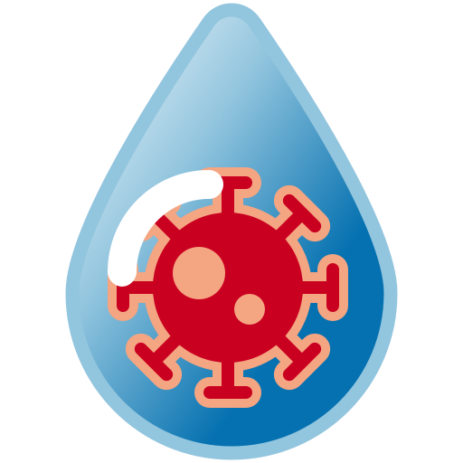

# Past Research: COVID-19 Wastewater Analysis

    

I was engaged in pivotal research on the detection of COVID-19 particles within Wisconsin's wastewater. This important project was carried out in conjunction with a committed team at the University of Wisconsin-Madison's Data Science Institute ([DSI](https://datascience.wisc.edu/)) which I was a part of, in partnership with the Department of Health Services ([DHS](https://www.dhs.wisconsin.gov/covid-19/wastewater.htm)) and the State Lab of Hygiene ([SLH](http://www.slh.wisc.edu/environmental/covid-19-wastewater/)). Our goal was to develop and refine methods for predicting COVID-19 case surges through the analysis of wastewater, contributing significantly to the efforts to preempt and mitigate the effects of the pandemic.

Furthermore, our team undertook the development of a specialized R package. This tool was designed to assist other states and entities in their wastewater analysis endeavors, offering a robust resource not only for the current health crisis but also as a versatile solution for monitoring the spread of other infectious diseases in the future.

### Results and Developments
- **Research Outcomes:** [Covid19-Wastewater-Analysis](https://github.com/AFIDSI/Covid19-Wastewater-Analysis)
- **R Package Progress:** [DSI Wastewater](https://github.com/AFIDSI/DSIWastewater)

This endeavor represented a crucial junction between data science and public health, illustrating the potential of advanced analytics to serve as an early warning system for health emergencies. Through our data-driven approach, we aimed to deliver insights leading to more effective strategies and preventive actions against the spread of diseases.

### How it Works
During the active phase of a COVID-19 infection, individuals expel the virus through their stool. This viral presence can be identified within community wastewater, wherein the viral concentration serves as a metric to approximate local infection rates. This approach emerges as a critical asset for public health authorities, enabling them to track the virus's proliferation throughout the community effectively.

The predictive capacity of wastewater analysis stands out, particularly for preempting outbreaks. By identifying viral traces in wastewater ahead of clinical symptom manifestation, this technique offers a preemptive glimpse into impending case surges. This aspect is crucial in managing COVID-19, a virus notorious for its asymptomatic transmission potential, allowing carriers to spread the infection unbeknownst to them.

Moreover, the application of wastewater surveillance extends beyond immediate outbreak response. It proves instrumental in gauging the impact of vaccination campaigns and various public health interventions, offering a broad, anonymized spectrum of community health dynamics. This methodology not only underscores the innovative intersection of epidemiology and environmental science but also reinforces the foundational role of data in steering public health policy and practice.
