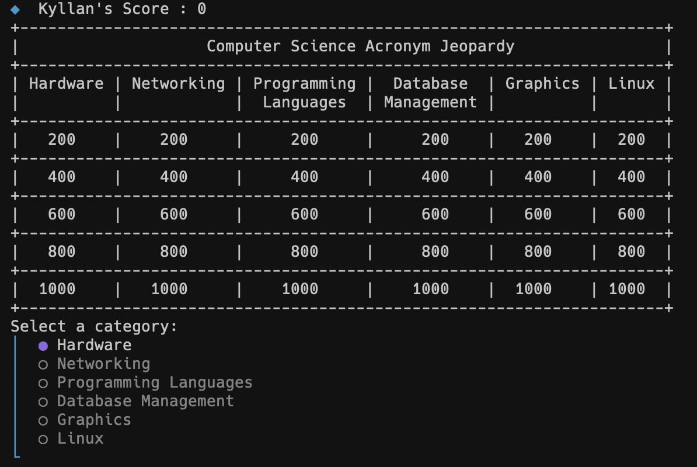

# CS-Acronym-Jeopardy NPM Game
#### August 2023



I created a NPM game called CS-Acronym-Jeopardy. You can play it right in the command line using the command ```npx cs-acronym-jeopardy```. The game is a jeopardy style game where you are given an computer science related acronym and you have to guess what it stands for. The game is written in javascript and uses the npm package manager. You can view the project [GitHub repo](https://github.com/kyllan16693/CS-Acronym-Jeopardy/tree/main) or you can view the [NPM Repo](https://www.npmjs.com/package/cs-acronym-jeopardy). But all you have to do to play is run this command on any computer that has node.js installed:
```
npx cs-acronym-jeopardy
```

Be on the lookout for more updates to this game in the future.

Learn how to install node.js [here](https://nodejs.org/en/download/).