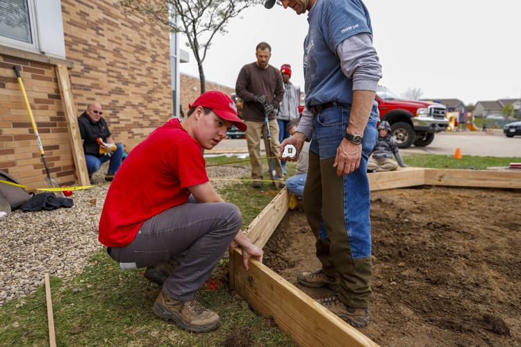
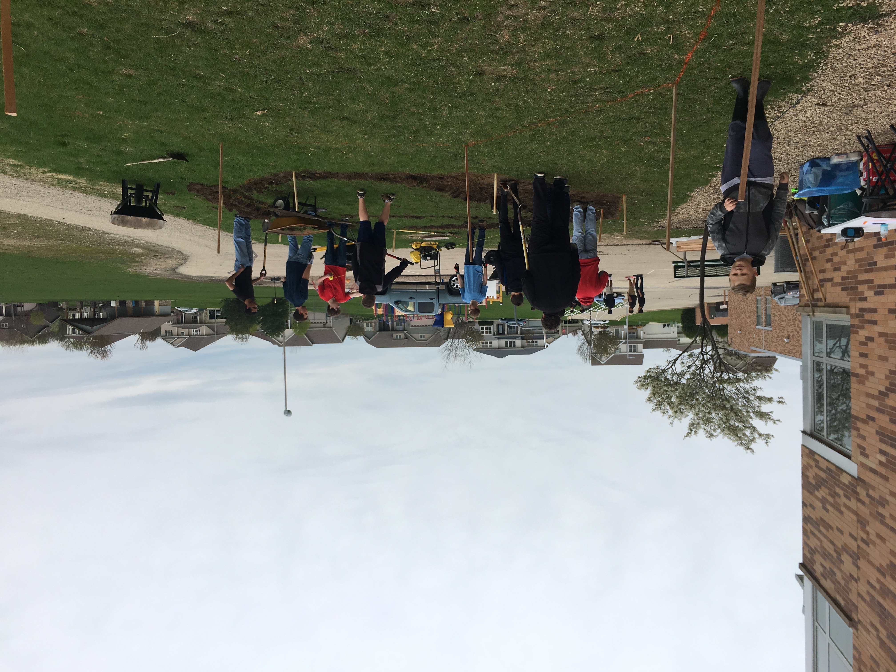
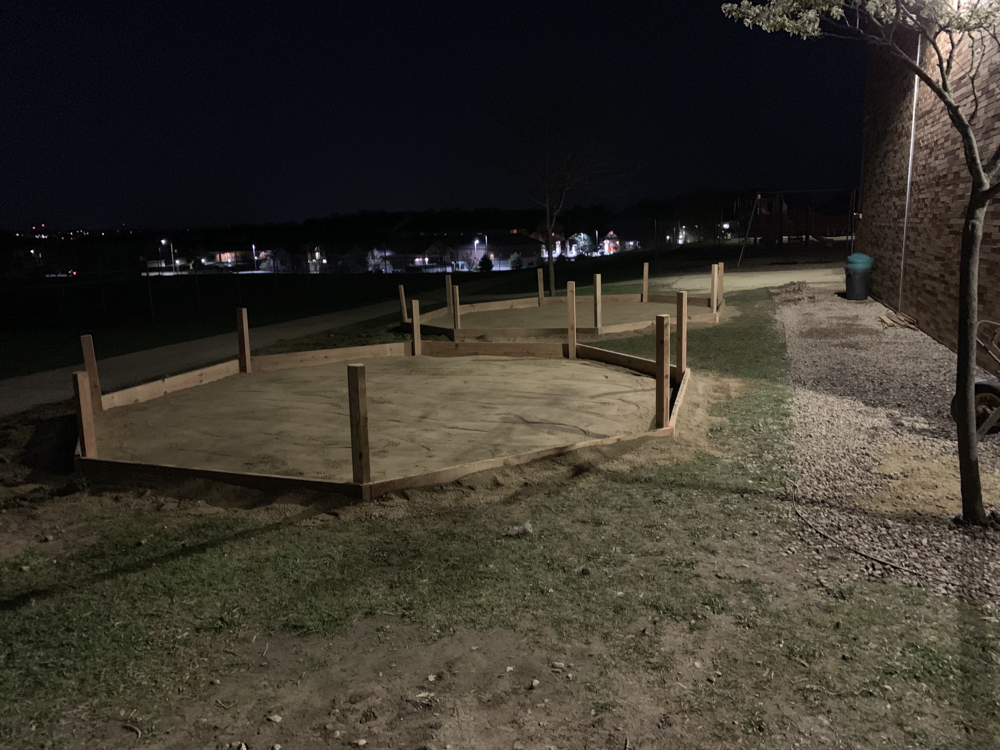
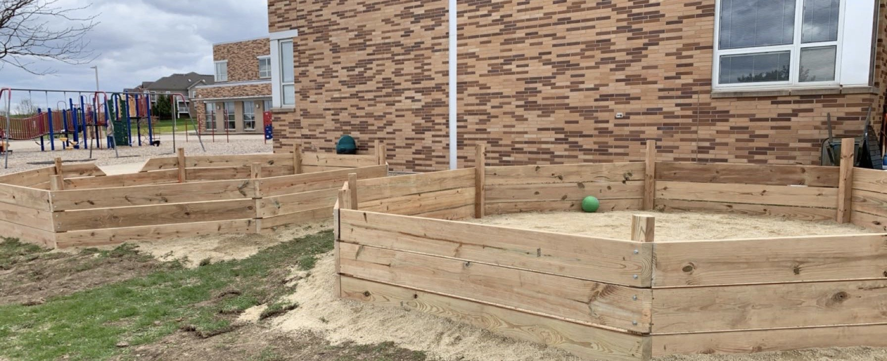
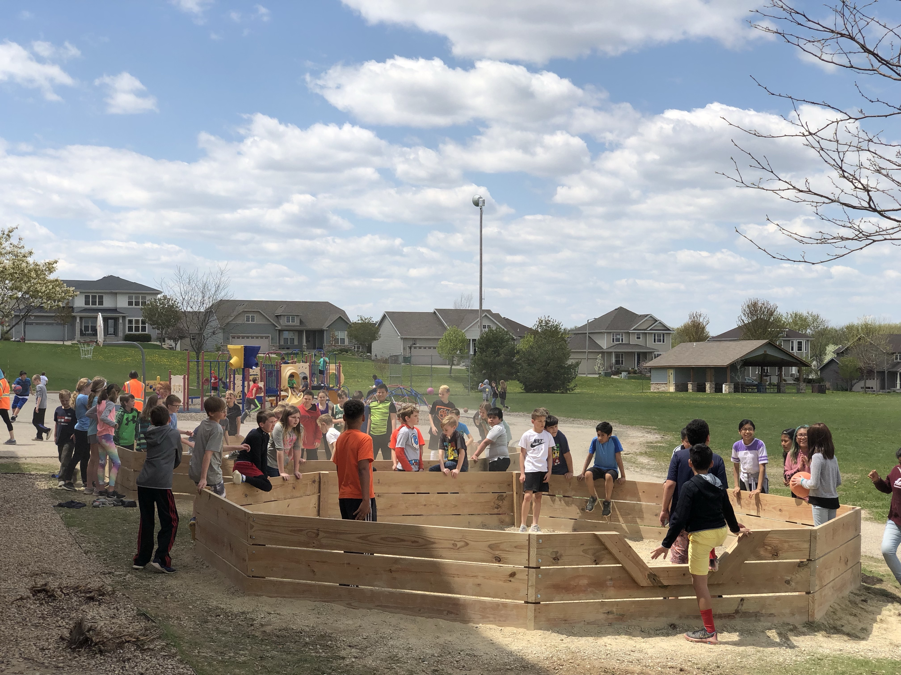

# Eagle Scout Project
#### June 2019

For my Eagle Scout project, I orchestrated a comprehensive service initiative aimed at enriching my local community. This endeavor mobilized over 40 volunteers, cumulating in excess of 250 hours of dedicated service. The project's ambition was the construction of two Ga-ga Ball pits at Glacier Edge Elementary School, providing an engaging recreational outlet for children during recess. These objectives were met with resounding success, marking the completion of both pits.

In orchestrating this project, I engaged in extensive collaboration with my fifth-grade teacher, who served as a crucial intermediary with the school's administration and Parent-Teacher Organization. This partnership facilitated the meticulous planning and execution phases of the project. I assumed the responsibility for designing the pits, selecting and procuring the necessary materials, and devising effective leadership strategies for volunteer coordination and team management. The project unfolded over two months, demanding rigorous planning and a strategic approach to volunteer engagement. Through this initiative, I not only contributed a tangible asset to the school but also honed my leadership, project management, and community service skills.

   
    
   
   
   
   

View the front page Verona Press article written about me <a href="https://www.veronapress.com/news/community/eagle-scout-creates-ga-ga-pits-at-ge/article_13206b0b-7301-52e0-b259-f63adbcb3280.html" target="_blank" rel="noopener noreferrer">here</a>.