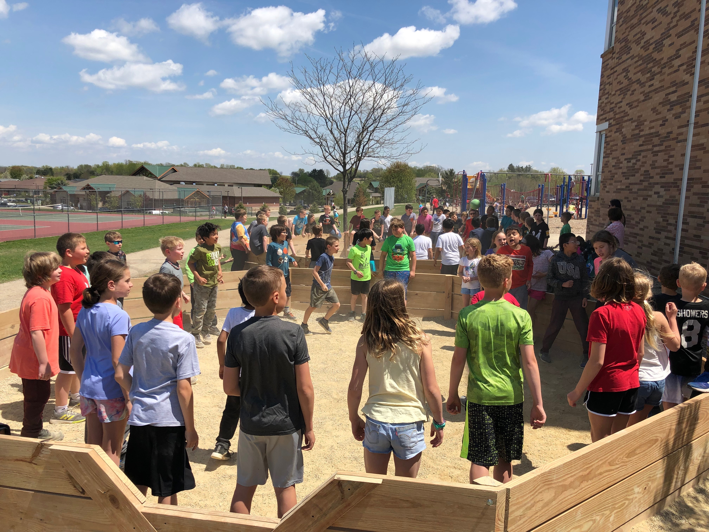

# Eagle Scout Project
#### June 2019

I planned and developed a service project to give back to my community. I had over 40 people volunteer to help; we completed over 250 hours of service. The project goal was to build two "Ga-ga Ball" pits for Glacier Edge elementary school for youth to enjoy at recess; we successfully completed the two pits. I coordinated the planning and development of the project with my fifth-grade elementary school teacher as a liaison to school administrators and the PTO. I created plans for building the pits, chose and purchased supplies for the project. I then came up with strategies to lead the work teams and recruit volunteers. It required two months of intricate planning.

 

View the front page Verona Press article written about me [here](https://www.veronapress.com/news/community/eagle-scout-creates-ga-ga-pits-at-ge/article_13206b0b-7301-52e0-b259-f63adbcb3280.html)