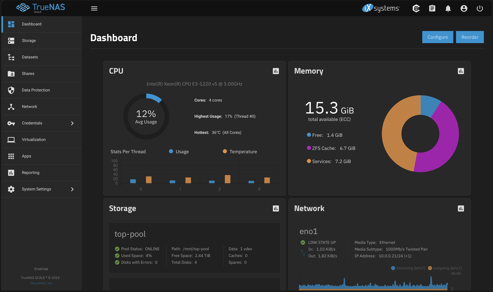

# Homelab

## Homelab 2.5 (Update)
#### July 2023

I found an old server tower for sale and picked it up. I'm not sure what it used to be but it has an Intel S1200SPL motherboard and a Intel Xeon CPU E3-1220 v5 @ 3.00GHz with 16Gb of ram. I wanted to install Truenas scale on it but after many attempts, it wouldn't work so I installed Truenas core and then upgraded to scale. It is currently running Nextcloud and a Cloudflare tunnel so I can access it from outside my home network. I plan on installing some more applications on it in the future when I get more storage.

## Homelab 2.0 (Update)
#### January 2023

This January I upgraded my homelab a lot. I replaced my old nas(which was 2 hard drives connected to a Raspberry Pi) to a Drobo 5N. Sadly this company is no longer in business, but I was able to find a used one for a good price. I now have over 14TB (raw) of storage. While compared to some new NAS's, its not very powerful but it's good enough to run Plex and backup all of my data. I also upgraded my network, I took the old Pi and turned it into a <a href="https://pi-hole.net/" target="_blank" rel="noopener noreferrer">Pi-hole</a>; which acts as a recursive DNS server and blocks any requests leaving or coming in that is a know ad or malware site.

## My Homelab 1.0
#### December 2021

A "Homelab is the name given to a server (or multiple server setup) that resides locally in your home and where you host several applications and virtualized systems for testing and developing or for home and functional usage."<a href="https://linuxhandbook.com/homelab/" target="_blank" rel="noopener noreferrer">-Linux Handbook</a> Over the past year, I have been building my homelab and learning about networking, virtualization, and server administration. I have been using a Raspberry Pi 3 as my main server, connected to 5TB of storage. I am running a headless install of Raspberry PI OS with OpenMediaVault <a href="https://www.openmediavault.org/about.html" target="_blank" rel="noopener noreferrer">(OMV)</a> to control my server. In OMV, I have set up a docker container to run Plex Media Server <a href="https://support.plex.tv/articles/200288286-what-is-plex/" target="_blank" rel="noopener noreferrer">(Plex)</a> Which I can use to stream my media to my TV or other devices. I have also set up my home computers to backup to my NAS regularly. My next step for my homelab would be to purchase a dedicated NAS and move off of the Raspberry Pi. I would also like to set up a VPN server to access my home network remotely.